# Vergleich: eigener Renderer vs. echtes MathJax

Automatisch erzeugt von `scripts/mathjax-compare.mjs` (FONT_PX=60). Bilder in diesem Verzeichnis - links unser Renderer, rechts MathJax.

Neu erzeugen: `node scripts/mathjax-compare.mjs`

## Schräger Bruch: 1/128

> MathJax hat keinen eingebauten schrägen (einzeiligen) Bruch - Referenz zeigt die naheliegende TeX-Entsprechung (normaler Text "1/128"). Unser Renderer hebt/senkt Zähler/Nenner bewusst (docs/Beschriftung.md "weniger Höhe").

| Unser Renderer | MathJax |
|---|---|
| 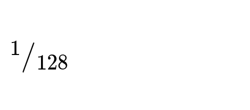 | 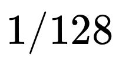 |

## Gerader Bruch mit Exponent: (1/10)^3

| Unser Renderer | MathJax |
|---|---|
| 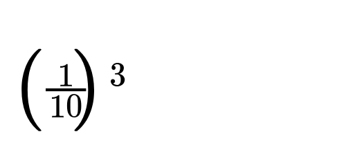 | 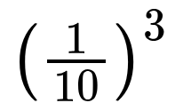 |

## Buchstabe mit Exponent: l^2

> MathJax italisiert einzelne Variablen (Math-Italic-Font) - unser Renderer nutzt durchgehend den (aufrechten) MathJax-Main-Font, siehe docs/MATHJAX_METRICS.md §6.

| Unser Renderer | MathJax |
|---|---|
| 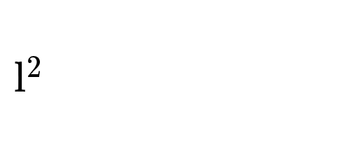 | 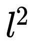 |

## Zahl mit Exponent: 2^18

| Unser Renderer | MathJax |
|---|---|
| 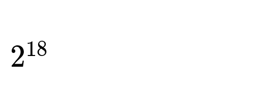 | 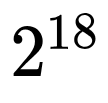 |

## Zahl mit Exponent: 10^5

| Unser Renderer | MathJax |
|---|---|
| 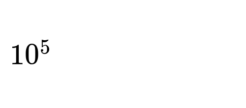 | 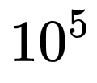 |

## Zahl mit Subscript: 1,41_10

| Unser Renderer | MathJax |
|---|---|
| 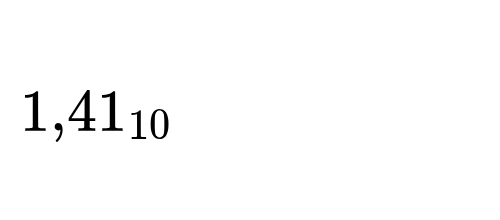 | 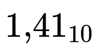 |

